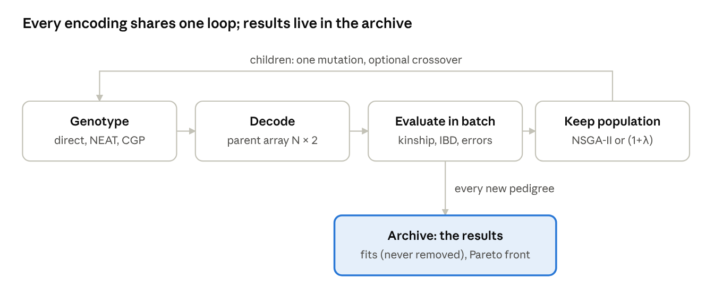
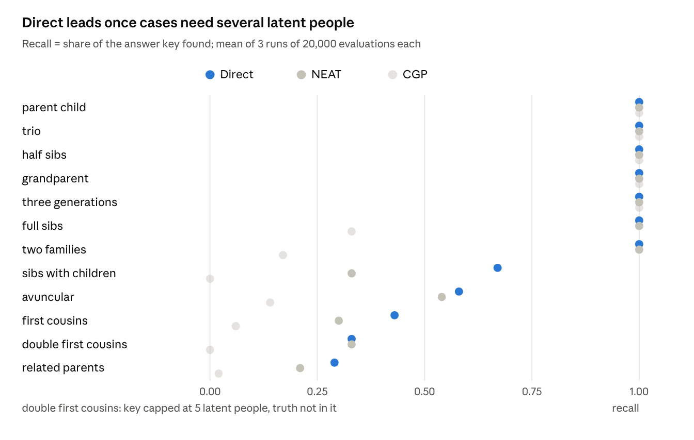

# Pedigree EA: Setup and Baseline Results

## Summary

Three baseline EAs now search for every pedigree compatible with pairwise relatedness data. On 11 findable clean test cases, the direct encoding with NSGA-II found the true pedigree in 29 of 33 runs; NEAT-like found it in 24 and CGP-like in 17. On the Task03 data (5 people), kinship plus IBS0 leaves exactly one pedigree with up to 2 unobserved people: 100, 200 and 300 are full siblings, 400 is a child of 200, and 500 is unrelated.

- **Built:** an exact pedigree model and evaluator (kinship, IBD0/1/2, inbreeding), a batched numpy version, a brute-force enumerator for answer keys, 12 clean test cases, three encodings, two search strategies, file readers for PLINK2/KING output, and optional run logging.
- **Works well:** small and medium cases, where every encoding finds every correct pedigree. EA and brute force agree on what counts as a fit (0 extra fits in every run).
- **Main problems:** selection rewards the lowest error rather than any fit within tolerance, so on noisy data it drops plausible pedigrees in favour of inbred ones that fit the noise; populations converge and stall; CGP with (1+λ) gets stuck. Two encodings (cyclic, tree GP) still need design decisions.

## Problem and input data

The goal (problem.md) is to find many pedigrees compatible with pairwise relatedness among observed people, not only the single best one. A pedigree may add unobserved (latent) people; each person has at most two parents, no one can be their own ancestor, and couples must be able to be one male and one female.

The search accepts three kinds of pairwise input:

| Input | Values per pair | Source | What it can tell apart |
| --- | --- | --- | --- |
| IBD | IBD0, IBD1, IBD2 | PLINK `--genome`, KING `--ibdseg`, or simulation | Parent–child (0, 1, 0) from full siblings (¼, ½, ¼) |
| Kinship | Kinship coefficient | KING-robust `.kin0` | Only degree: parent–child and siblings both give 0.25 |
| KING kinship + IBS0 | Kinship and IBS0 | PLINK2 `--make-king-table` `.kin0` | Parent–child from siblings, via IBD0 ≈ IBS0 ÷ IBS0 of unrelated pairs |

IBS0 is the fraction of variants where two people are opposite homozygotes. It can only occur where they share no IBD copy, so dividing by the unrelated rate estimates IBD0 without inferring IBD1 or IBD2. Kinship and IBD0 get separate tolerances (default 0.05 and 0.15).

## Core model and evaluation

Every predicted value is exact, including for pedigrees with inbreeding, and two independent methods agree on all tested pedigrees.

- **Pedigree model:** people are observed or latent, with 0–2 unordered parents; a missing parent counts as an unrelated unknown founder. Latent people that cannot affect observed relationships are pruned, and two pedigrees are the same if they differ only in latent names.
- **Kinship:** the standard recursion in topological order.
- **IBD0/1/2:** exact backward gene dropping over Jacquard's 9 identity states. It matches a forward gene-drop simulation (20,000 replicates) on inbred pedigrees.
- **Batched numpy evaluation:** pedigrees as fixed-size parent arrays (B × N × 2). Kinship uses A = LDLᵀ (no topological sort), and IBD for outbred pairs uses a closed form from parents' kinships; inbred pairs fall back to the exact method. On 300 random batches (about 30,000 outbred and 20,000 inbred pairs) the error against the exact code was 0.
- **Brute force:** enumerates every pedigree within bounds and prunes branches that can no longer fit, using the fact that kinship and IBD2 never decrease and IBD0 never increases as parents are added. A plain enumeration gave identical results on 13 small cases.

## Encodings, strategies and how candidates are kept

Each encoding only defines a genotype, a decoder and its mutations; evaluation, selection, the archive and scoring are shared, so encodings are compared on the same terms.

The population keeps searching; the archive holds the results, and a fit enters it the first time any child reaches it.

| Encoding | Genotype | Validity | Strategy | Status |
| --- | --- | --- | --- | --- |
| Direct | The parent array itself; 10 edit operators (small, medium, major) from the design notes | Edits that would create a cycle are rejected | NSGA-II, no crossover | Implemented |
| NEAT-like | Edge genes with innovation numbers, starting empty | Decoder skips genes that break the rules | NSGA-II, crossover 0.5 | Implemented; latent alignment across genomes and speciation still open |
| CGP-like | Each person reserves 2 parent inputs pointing to earlier positions in an evolvable order | Acyclic by construction | (1+λ), λ = 4, restart after 2,000 evaluations without a new fit | Implemented |
| Cyclic + decoder | Graph that may contain cycles | Decoder to a valid pedigree | — | Not implemented: decoder, weights and cyclicity measure open |
| Tree GP | Program that builds the pedigree | — | — | Not implemented: function set open |

- **NSGA-II:** 100 parents make 100 children (binary tournament, then one mutation). Of the 200, the best 100 survive by Pareto front and crowding on total error, worst-pair error and number of latent people; identical arrays are pushed to the back.
- **(1+λ):** a child replaces the parent unless the parent dominates it, which allows sideways moves.
- **Archive:** stores every new fitting structure with the evaluation it appeared at, plus the current Pareto front. Fit status does not affect selection.
- **Logging (optional):** per-generation progress to `logs/<run>_<stamp>.jsonl` and results to `results/<run>_<stamp>.json`, one timestamp per run, never under `src/`.

## Test cases and answer keys

Twelve clean test cases cover the structures listed in the project notes, each with an exact IBD input and a brute-force answer key of every pedigree that reproduces it.

| Case | Observed | Latent in truth | Answer key size (outbred) |
| --- | --- | --- | --- |
| parent\_child | 2 | 0 | 2 (2) |
| trio | 3 | 0 | 1 (1) |
| three\_generations | 3 | 0 | 3 (3) |
| full\_sibs | 2 | 2 | 1 (1) |
| half\_sibs | 2 | 1 | 3 (3) |
| grandparent | 2 | 1 | 3 (3) |
| avuncular | 2 | 3 | 23 (5) |
| first\_cousins | 2 | 4 | 65 (7) |
| double\_first\_cousins | 2 | 8 | 3 (3), key capped at 5 latent |
| sibs\_with\_children | 5 | 2 | 1 (1) |
| two\_families | 4 | 2 | 2 (2) |
| related\_parents | 2 | 5 | 126 (0) |

- **Bounds:** each answer key allows as many latent people as the truth has, capped at 7 people in total, with a match tolerance of 1e-6. Within those bounds it is complete, so EA recall is measured against it.
- **Ambiguity is real:** half-sibs, grandparent–grandchild and avuncular pairs share IBD (½, ½, 0), so these keys hold several equally correct pedigrees.
- **double\_first\_cousins** cannot contain its own truth (8 latent people needed); its key holds 3 double half-avuncular pedigrees with identical IBD.

## Results on clean test cases

All three encodings find every correct pedigree on the five smallest cases; with more latent people, Direct finds the most and CGP falls to near zero.

Source: `results/baselines_20261007-172838-915031.json` · 12 cases × 3 encodings × 3 seeds.

| Encoding | Runs that found the true pedigree (of 33) | Cases found in at least one run (of 11) |
| --- | --- | --- |
| Direct | 29 | 11 |
| NEAT-like | 24 | 9 |
| CGP-like | 17 | 7 |

- **Outbred answers are found far more often than inbred ones:** Direct's outbred recall is 1.00 on avuncular and 0.95 on first cousins, against 0.58 and 0.43 overall.
- **No run reported a fit outside the answer key,** so the EA and brute force agree on what fits.
- **Runs repeat themselves:** only about 7–15% of evaluations were new pedigrees, which caps how many distinct answers a run can collect.
- double\_first\_cousins is left out of the truth counts: its truth needs 8 latent people and the search allows 5.

## Results on Task03 data

With kinship and IBS0, only one pedigree fits with up to 2 latent people: 100, 200 and 300 are full siblings, 400 is a child of 200, and 500 is unrelated. Kinship alone cannot single it out.

The input is the PLINK2 KING table for samples 100–500 (sex unknown for all). Negative kinship for unrelated pairs is treated as 0.

| Target | Tolerance | Answer key, ≤ 2 latent (outbred) | Answer key, ≤ 3 latent (outbred) | Direct EA finds the sibling pedigree (≤ 2 latent) |
| --- | --- | --- | --- | --- |
| Kinship only | 0.05 | 66 (11) | 979 (34) | 0 of 3 runs |
| Approximate IBD0/1/2 | 0.15 | 12 (1) | 291 (3) | 2 of 3 runs |
| Kinship + IBS0 | 0.05 / 0.15 | 1 (1) | 81 (3) | 1 of 3 runs |

- **Why IBS0 decides:** parent–child pairs cannot be opposite homozygotes, so their IBS0 should be near 0. Pairs 100–200, 100–300 and 200–300 show 0.017–0.022, about ¼ of the unrelated rate (0.075), which is the sibling value.
- **The report's six hand-built candidates** all fit kinship equally (worst mismatch 0.042). Candidates 1, 2, 3, 5 and 6 each make one of those three pairs parent–child and miss IBD0 by about 0.47; only candidate 4 fits. Candidate 6 as written omits person 100.
- **One weaker pair:** 200–400 has IBS0 0.0086 (IBD0 ≈ 0.11), not the near-0 a parent–child pair should show. It is still far below the sibling value; genotyping error is the likely cause, and IBD segments (KING `--ibdseg`) would settle it.
- **EA failure mode:** on the kinship-only target, inbred pedigrees fit the noise slightly better (total error 0.10 versus 0.12) and replace the sibling pedigree. On kinship + IBS0, runs stall at worst-pair error 0.057–0.074; 100,000 evaluations did not help.

## Limitations and next steps

The biggest gain should come from changing selection, not from adding encodings: the population is steered toward the lowest error, while the goal is every pedigree within tolerance.

| Issue | Effect seen | Proposed change |
| --- | --- | --- |
| Error below tolerance still counts | Plausible pedigrees lose to ones that fit the noise | Score error only beyond tolerance, e.g. max(0, error − tol) |
| Population converges | Runs stall at near-misses; 7–15% of evaluations are new pedigrees | Restarts or random immigrants; diversity or novelty pressure |
| Duplicates detected by array only | Relabelled copies of one pedigree fill several slots | Deduplicate by structure |
| No multi-step operators | Sibling groups are hard to build or rebuild | Operator that makes a group full siblings |
| Archive not used for search | Fits found once are not explored further | Reseed the population from archived fits |
| CGP with (1+λ) | Cannot reverse parent and child without a worse intermediate step | Run CGP under NSGA-II, or relax acceptance |
| Approximate inputs | IBD from IBS0 assumes one unrelated baseline; LD pruning failed in Task03 | Proper IBD segments from the VCF in a separate tools environment |

Still to decide:

- **Inbreeding:** allow, reject, or prefer outbred pedigrees through an objective. Most answer-key pedigrees are inbred, and recall depends on this choice.
- **Cyclic genotype:** the decoder, edge weights, and how to measure and use cyclicity.
- **Tree GP:** the function set, and how to share latent people in a tree.
- **Known sexes:** read from `.psam` but not yet used by the search.
- **Noise model:** a likelihood (and optionally a prior) per relationship would rank pedigrees by probability rather than error; Ped-sim could supply realistic variation.
