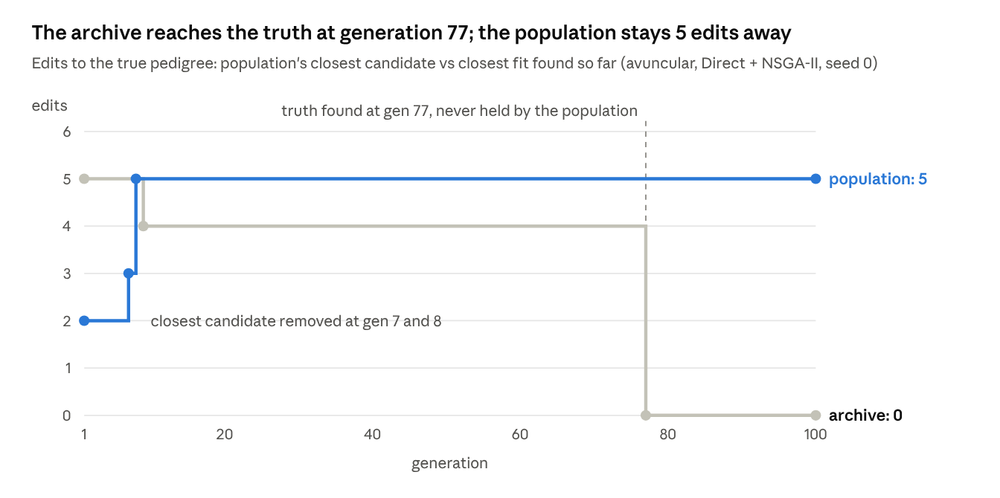

# Pedigree EA: Recorder Design, Results and the Population–Archive Gap

Oct 8, 2026 · @ywatcher

## Summary

A recorder that watches what the search cannot see showed why our EAs miss correct pedigrees: they find them, but selection throws them away. In the avuncular test case the true pedigree was created at evaluation 7,677, recognized as a fit, and dropped from the population in the same generation; it was never held again.

- **Built since the last report:** a POSS-style strategy, tolerance-based objectives, a KING kinship + IBS0 input, grid training across grids, a run-record database (each pedigree stored once, population changes per generation, lineage), a recorder for candidates closest to hidden references with removal events, and a browser explorer over the database.
- **Results:** on clean cases the direct encoding still finds the truth in most runs; on the Task03 data, direct NSGA-II with tolerance-based objectives found and kept the one plausible pedigree in all 3 runs with up to 3 latent people.
- **The gap:** the archive holds the truth (0 edits away) while the population's closest candidate stays 5 edits away. Two causes combine: the `n_latent` objective makes the truth strictly worse than simpler fits, and duplicates are detected by array, so relabelled copies of 6 pedigrees fill all 100 slots.

## Problem setting

The task is to find every pedigree whose expected pairwise relatedness matches the observed data, not only the single best one. A pedigree may add unobserved (latent) people; each person has at most two parents, nobody is their own ancestor, and couples must be able to be one male and one female.

| Input | Per pair | Fits when |
| --- | --- | --- |
| IBD | IBD0, IBD1, IBD2 | each within `tol` |
| Kinship | kinship | within `tol` |
| KING kinship + IBS0 | kinship and IBS0 (IBD0 ≈ IBS0 ÷ IBS0 of unrelated pairs) | kinship within `tol`, IBD0 within `tol_ibd0` |

- **A fit** is a pedigree within tolerance on every pair. The algorithm may know whether a candidate fits, since that uses only the data; it must never see a true pedigree.
- **Objectives** (all minimized): total and worst per-pair error, the same counted only beyond tolerance (`excess_total`, `excess_worst`), pairs out of tolerance, number of latent people, inbreeding.
- **Clean test cases:** 12 standard pedigrees with exact IBD input and brute-force answer keys (every pedigree within bounds that reproduces the input).
- **Task03:** 5 people (100–500) with PLINK2 KING kinship and IBS0. With up to 2 latent people exactly one pedigree fits: 100, 200, 300 full siblings, 400 a child of 200, 500 unrelated. It is stored as reference `siblings`.

### Test cases in this report

Each clean case starts from a known true pedigree; its exact expected IBD among the observed people is the search input, and the answer key lists every pedigree, within the case's latent limit, that reproduces that input to within 1e-6.

| Case | Observed | True pedigree | Latent in truth | Input (IBD0, IBD1, IBD2) | Answer key (outbred) |
| --- | --- | --- | --- | --- | --- |
| avuncular | A, B | L1 and L2 are the parents of A and L3; L3 is a parent of B, so A is B's aunt or uncle | 3 | A–B: (½, ½, 0) | 23 (5) |
| first cousins | A, B | L1 and L2 are the parents of L3 and L4; L3 is a parent of A and L4 of B | 4 | A–B: (¾, ¼, 0) | 65 (7) |
| sibs with children | A, B, C, D, E | L1 and L2 are the parents of A, B, C; A is a parent of D and B of E | 2 | 10 pairs: siblings (¼, ½, ¼), parent–child (0, 1, 0), aunt/uncle (½, ½, 0), D–E cousins (¾, ¼, 0) | 1 (1) |
| Task03 | 100, 200, 300, 400, 500 | unknown; reference `siblings` = 100, 200, 300 full siblings, 400 a child of 200, 500 unrelated | — | KING kinship + IBS0 per pair (measured, noisy), tolerance 0.05 for kinship and 0.15 for IBD0 | 1 with ≤2 latent (1); 81 with ≤3 latent (3) |

- **Why these cases:** avuncular, half-siblings and grandparent–grandchild share the same IBD (½, ½, 0), so several pedigrees fit equally; first cousins needs 4 latent people; sibs with children has 5 observed people and a single correct answer.
- **Search bounds:** each run may use at most as many latent people as its case's answer key (3, 4 and 2 for the clean cases; 2 or 3 for Task03), so recall is measured against a complete answer key.
- **Run settings:** NSGA-II with a population of 100 (direct and NEAT-like); POSS with 8 children per step; 20,000 evaluations per run; 3 seeds per setting. The avuncular run used in "The gap" is Direct + NSGA-II, seed 0, 10,000 evaluations.
- **Where the true pedigree is used:** only to build the input and to score runs (recall, distance to the truth). The search sees the input values alone.

## Recorder design for diagnosing an EA

The recorder found the gap because it watches what the search cannot see; a log of the best candidate per generation would have hidden it.


The search writes only facts; every view used for diagnosis is derived afterwards, so new questions do not need new runs.

- **Record the population, not just the best.** The best candidate looked fine all run (zero error). The failure showed only in who was kept and who was dropped.
- **Keep the archive and the population apart.** The archive answers "what was found"; the population answers "what can be built on". The gap between them is the diagnosis.
- **Hide references from the search, show them to the recorder.** Distances to a known truth (or a believed answer, as for Task03) measure progress without leaking information; since they are computed on read, references can be added after a run.
- **Record events, not only states.** A removal event (closest candidate lost, what replaced it, distance before and after) points at the generation where things went wrong, and the explorer can jump to it.
- **Use structural identity.** Each pedigree is stored once under an exact canonical form, so "is the truth in the population" is an exact query, and relabelled copies are recognized as the same pedigree.
- **Keep lineage.** First appearance, operator and parents showed that the truth came from `make_siblings` applied to a parent 6 edits away, and that it never survived a single selection.
- **Store facts, derive the rest.** Stored: identity, inputs, population changes per generation with keyframes, first appearances with objectives at entry, provenance. Derived: objectives under any setting, best, Pareto front, closest to any reference, removal events, per-pair values. A 36-run grid takes 1.9 MB.

## Current results

Direct NSGA-II remains the strongest baseline; NEAT-like with POSS is best on cases with more latent people; CGP-like is weakest everywhere. All runs: 3 seeds, 20,000 evaluations each.

**Clean test cases** (recall = share of the answer key found):

| Case | Direct + NSGA-II | Direct + POSS | NEAT + NSGA-II | NEAT + POSS | CGP + NSGA-II |
| --- | --- | --- | --- | --- | --- |
| avuncular | 0.58 (truth 3/3) | 0.59 (2/3) | 0.51 (1/3) | **0.64 (3/3)** | 0.28 (1/3) |
| first cousins | 0.43 (2/3) | 0.40 (3/3) | 0.32 (0/3) | **0.57 (3/3)** | 0.12 (0/3) |
| sibs with children | **0.67 (2/3)** | 0.33 (1/3) | 0.33 (1/3) | 0.33 (1/3) | 0.00 (0/3) |

**Task03** (does the population reach the sibling pedigree?):

| Max latent | Method | Objectives | Fewest edits (mean) | Edits at end | Found and held |
| --- | --- | --- | --- | --- | --- |
| 3 | **Direct + NSGA-II** | **tolerance-based** | **0.0** | **0.0** | **3 of 3** |
| 3 | NEAT + POSS | both settings | 3.3 | 4.7 | 2 of 6 |
| 2 | Direct + NSGA-II | tolerance-based | 1.3 | 2.7 | 2 of 3 |
| 2 | Direct + NSGA-II | default | 1.3 | 2.7 | 1 of 3 |
| either | all CGP; Direct + POSS | any | 3–7 | 6–8 | 0 |

- Most answer-key pedigrees are inbred, so overall recall understates success: Direct NSGA-II finds 95–100% of the outbred answers on avuncular and first cousins.
- On Task03 the answer key with up to 3 latent people has 81 pedigrees, almost all inbred, so recall reads 0.05 even when the one plausible pedigree is held.
- Only 7–15% of evaluations are new pedigrees; NSGA-II populations collapse to a handful of structures.

## The gap

The search creates the true pedigree, but its population never holds it. In this run the population starts 2 edits away, drifts to 5 when its closest candidates are removed at generations 7 and 8, and stays there; the archive of fits reaches the truth at generation 77.



Source: `results/db/grid_encodings_20261008-111312-807126.sqlite`, run 5 (avuncular, Direct + NSGA-II, seed 0).

The truth was made by `make_siblings` from a parent 6 edits away, recognized as a fit, and dropped in the same generation's survival. The run still counts it as found, because the archive keeps every fit, but nothing near it can be explored afterwards.

## Why the gap happens

The truth is dominated, and NSGA-II never reaches the front it is in. Objectives are f = (ibd\_total, ibd\_worst, n\_latent), all minimized; x dominates y when x is no worse everywhere and strictly better somewhere.

Population at generation 76, just before the truth appeared (100 members, 6 distinct pedigrees):

| Candidate | Copies | f | Fits | Front | Edits to truth |
| --- | --- | --- | --- | --- | --- |
| #2, #3, #4 (half-sibs, grandparent, …) | 8, 17, 25 | (0, 0, 1) | yes | 1 | 5 |
| #5, #6, #9 (A and B unrelated) | 10, 25, 15 | (0.5, 0.5, 0) | no | 1 | 5–6 |
| truth (not in population) | 0 | (0, 0, 3) | yes | **2** | 0 |

- **Dominance:** (0, 0, 1) dominates (0, 0, 3): equal errors, 1 latent person instead of 3. The truth falls to front 2. The unrelated pedigrees (0.5, 0.5, 0) are not dominated, because 0 latent is fewer than 1, so a bad pedigree holds half the population.
- **Survival:** from parents and children (200), NSGA-II keeps whole fronts in order until 100 are filled, using crowding only inside the last front it touches. All 100 parents are already in front 1, so only front 1 survives and the truth is excluded whatever its crowding.
- **Duplicates:** copies are pushed to the back, so a distinct front-2 pedigree would beat a front-1 copy. But copies are detected by parent array, and the 6 pedigrees have many arrays (latent people in different slots and orders), so front 1 holds more than 100 "distinct" arrays.

```latex
\text{gap}(g) = \min_{x \in P_g} d(x, T) - \min_{x \in A_g} d(x, T) = 5 - 0 = 5 \quad (g \geq 77)
```

Here P\_g is the population, A\_g the fits found by generation g, T the truth, d the number of parent-child edits.

| Change | Effect here | Keeps the truth |
| --- | --- | --- |
| Tolerance-based objectives with `n_latent` | (0, 0, 0, 3) still dominated by (0, 0, 0, 1) | no |
| Drop `n_latent` from survival, or use it only between non-fits | truth ties with the other fits in front 1 | yes |
| Detect duplicates by canonical structure | front 1 has 6 distinct pedigrees; their copies rank after the truth | yes |
| Keep all fits as a parent pool | truth stays usable even when dropped | indirectly |

## Problems and next steps

The first fix is to let the algorithm treat every fit as a solution; the recorder will show whether that closes the gap.

| Problem | Evidence | Next step |
| --- | --- | --- |
| Fits are not protected | truth found at evaluation 7,677, never in the population | fits rank first; `n_latent` only between non-fits |
| Duplicates by array, not structure | 6 pedigrees fill 100 slots | duplicates by canonical form |
| Fits found are not used again | archive is never read by the search | a share of parents drawn from all fits found |
| Populations collapse | 7–15% new pedigrees per evaluation | the three steps above; diversity pressure if still needed |
| `n_latent` shelters bad pedigrees | unrelated A, B (error 0.5) kept as half the population | same as the first step |
| CGP with (1+λ) stalls | 0 of 6 Task03 runs near the answer | run CGP under the fixed NSGA-II |
| Inputs are approximate | IBD0 from IBS0 with one baseline; LD pruning failed in Task03 | IBD segments from the VCF, in the separate tools environment |

- **Still to decide:** inbreeding (allow, reject or penalize), the cyclic and tree-GP encodings, use of known sexes, and a likelihood-based noise model.
- **Experiment design:** each fix becomes a grid axis (`fits_as_solutions`, duplicate rule, parent share from fits); judge by recall, outbred recall, and the population–archive gap curve in the explorer.
