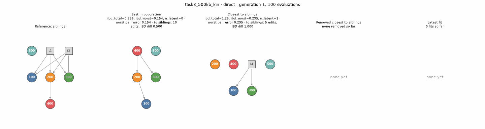
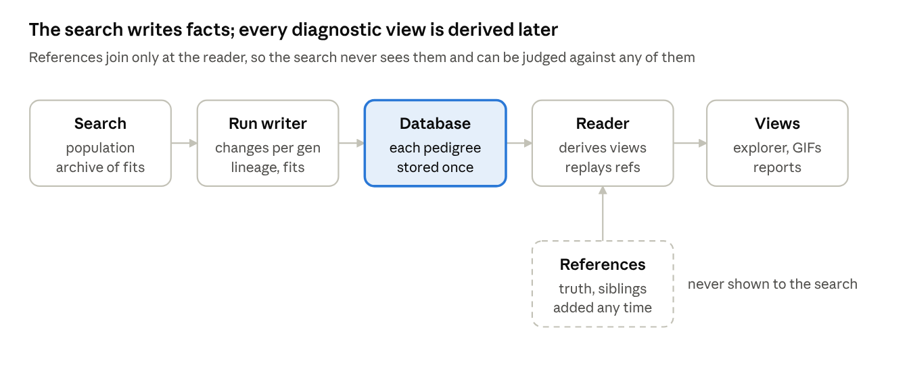

# Pedigree EA

Evolutionary search for **many distinct pedigrees compatible with pairwise genetic relationship estimates**. Run different evolutionary algorithms or bounded exhaustive brute-force search on supplied pairwise data. Observed people keep their identities; the search can introduce unobserved (latent) ancestors and compare alternative family structures.

This is a research project for comparing pedigree encodings, mutation operators, objectives, and search strategies. Small synthetic cases have bounded, exhaustive answer keys, so experiments can measure how many compatible structures a search recovers rather than only its best error.



Task03 example: Direct + NSGA-II finds a fitting pedigree after 16,876 evaluations. Circles are observed people; grey squares are latent ancestors; arrows point from parent to child. Panels compare the evolving population and latest fit with a sibling reference used only for analysis. This animation is from the October 8 baseline run, before fit-prioritized selection was added.

## Why evolutionary search alongside existing methods?

Established pedigree-reconstruction methods use particular relationship models, candidate-building rules, and data assumptions. These choices make inference tractable but can limit the structures considered. For example, PRIMUS builds family networks using relationships up to third degree; the Bonsai study identifies additional consanguineous relationship types as an area for extension. Such limits differ between tools; existing methods already support many complex families. [PRIMUS paper](https://pmc.ncbi.nlm.nih.gov/articles/PMC4225580/), [Bonsai paper](https://pmc.ncbi.nlm.nih.gov/articles/PMC8595950/)

Our motivation is to search pedigree structures directly rather than restrict every pair to a predefined list of relationship labels. Mutations can introduce shared latent ancestors, combine relationships across generations, and create multiple ancestry paths or inbreeding. The genetics evaluator scores the resulting structure, so the EA has the potential to explore combinations beyond a fixed relationship catalogue and retain several compatible explanations. New encodings and operators can extend that exploration without changing the observation types.

This complements established inference methods and bounded brute-force search: brute force provides complete answer keys for small cases, while EAs explore spaces too large to enumerate practically. Greater flexibility is a research aim, not a demonstrated accuracy advantage. Reachable structures still depend on the encoding, operators, latent-person bound, and evaluator assumptions; an EA does not guarantee finding every fit or resolving ambiguity in the data. We use reference cases and recorded search histories to measure those limits.

## What is implemented

### Inputs: observations taken by the algorithms

EA and brute-force search accept three kinds of pairwise observations, independently of the file format used to supply them:

| Target type | Observations per pair | Fit rule |
|---|---|---|
| `IBDData` | IBD0, IBD1, IBD2 | Every component differs by at most `tol` |
| `KinshipData` | Kinship coefficient | Absolute difference is at most `tol` |
| `KingData` | Measured kinship and IBS0 | Kinship difference is at most `tol`; estimated IBD0 difference is at most `tol_ibd0` |

For KING targets, observed IBD0 is approximated as IBS0 divided by an unrelated-pair IBS0 baseline. The baseline can be supplied explicitly; otherwise it is estimated from low-kinship pairs. Negative KING kinship is treated as zero during evaluation. This approximation is distinct from directly measured IBD-state proportions.

The shared pedigree model computes expected kinship, IBD0/1/2, Jacquard identity coefficients, and inbreeding. NumPy supports batched evaluation, with an exact fallback for inbred pairs. Pedigrees have at most two unordered parents per person and no directed cycles. Missing parents represent unrelated unknown founders. Sex consistency is checked by default, but known sample sexes loaded with `--psam` are currently only reported, not used by the search. Inbreeding is allowed.

### Input file formats: implemented parsers

The readers in [data/io.py](src/pedigree_ea/data/io.py) convert files into the target types above:

| File format | Parser output | Availability |
|---|---|---|
| Project IBD CSV: `id1,id2,ibd0,ibd1,ibd2` | `IBDData` | CLI and Python API |
| Project kinship CSV: `id1,id2,kinship` | `KinshipData` | Python API: `io.read_kinship` |
| PLINK `--genome` `.genome` table | `IBDData` from Z0/Z1/Z2 | CLI and Python API |
| KING `--ibdseg` `.seg` table | `IBDData` from IBD1Seg/IBD2Seg | CLI and Python API |
| KING-robust `.kin0` / `.kin` table | `KingData`, kinship only, or approximate IBD | CLI `--target king`, `kinship`, or `ibd`; Python API |
| Project pedigree TSV | Pedigree for truth, solutions, or references | Python API and viewer reference options |
| PLINK2 `.psam` | Sample IDs and known sexes | Reader implemented; `--psam` reports sexes only |

`io.read_pairwise` selects the pairwise reader by file extension. A KING `.seg` table is not the same format as Ped-sim's segment output. The top-level `example` file is an illustrative relationship chart, not an input-format specification.

### Optimization strategies

Strategies choose parents, apply variation, and select survivors; they share the same evaluator, bookkeeping engine, and results archive. They can be combined with different encodings rather than being tied to one pedigree representation.

**NSGA-II** maintains a fixed-size population, makes mutated children with optional crossover, and chooses survivors using Pareto ranks and crowding distance. Here it balances relationship error and pedigree complexity while searching for multiple compatible structures. Baselines use it with Direct (no crossover) and NEAT-like (with crossover). Public packages supply NumPy array operations and random sampling; DEAP is declared but is not used for selection or variation. Our [strategies/nsga2.py](src/pedigree_ea/ea/strategies/nsga2.py) implements the generation loop and tournaments; [pareto.py](src/pedigree_ea/ea/pareto.py) implements dominance, fronts, crowding, tournament selection, and fit-first survivor ranking. Canonical structure keys in [engine.py](src/pedigree_ea/ea/engine.py) identify relabelled duplicates.

**`(1 + lambda)`** keeps one parent and generates several mutated children per step. A dominating child is preferred; otherwise an acceptable neutral move can replace the parent. Restarts help escape stagnation. This is the CGP-like baseline, where neutral mutations can change inactive genes before they become useful. NumPy supplies arrays and random sampling; no public evolutionary package supplies this loop. Our [strategies/one_plus_lambda.py](src/pedigree_ea/ea/strategies/one_plus_lambda.py) implements acceptance, fit-first handling, and restarts; it uses our dominance helper in [pareto.py](src/pedigree_ea/ea/pareto.py).

**POSS-style search** uses a variable-size Pareto collection as its parent population, starting from an empty pedigree and growing it through mutation. Here it trades error against latent complexity, preserves distinct equally scored structures, and can make several edits in one mutation step. NumPy supplies arrays and random sampling; there is no external POSS implementation in use. Our [strategies/poss.py](src/pedigree_ea/ea/strategies/poss.py) implements parent selection, batched offspring, dominance updates, structure deduplication, and the population cap. This is an adaptation for pedigree search; theoretical POSS approximation guarantees are not claimed for this problem.

All three strategies default to `fits_first=True`: fit status influences retention separately from the objectives. NSGA-II prioritizes fits during survival; POSS protects them from dominance removal; `(1 + lambda)` accepts moves between fits. Population capacities and restarts still apply. Independently, [archive.py](src/pedigree_ea/ea/archive.py) retains every distinct fit discovered, including its originating genotype, even if it leaves the population. Archived fits are not currently an additional parent pool. Set `strategy_params={"fits_first": False}` to compare ordinary objective-based retention.

Bounded exhaustive enumeration in [reference/brute_force.py](src/pedigree_ea/reference/brute_force.py) is also available as a standalone search and as an answer-key generator for small problems; it is not an evolutionary strategy.

### Pedigree encodings

An encoding defines what evolution mutates and how that genotype becomes a pedigree. All implemented encodings decode to the same parent array and use the same genetics evaluator; they can be paired with different search strategies. NEAT-like and CGP-like are custom adaptations of established methods, not external package integrations or claims to reproduce the original algorithms in full.

| Encoding | Main idea for this problem | Status |
|---|---|---|
| [Direct](src/pedigree_ea/ea/representations/direct.py) | Evolve the pedigree's parent assignments themselves | Implemented baseline |
| [NEAT-like](src/pedigree_ea/ea/representations/neat.py) | Grow relationships and align edge genes for crossover | Implemented adaptation; identity and speciation gaps remain |
| [CGP-like](src/pedigree_ea/ea/representations/cgp.py) | Encode parent connections in an ordered graph with inactive genes | Implemented adaptation; acyclic by construction |
| [Tree GP](src/pedigree_ea/ea/representations/treegp.py) | Evolve a program that constructs the pedigree | Design only |

**Direct encoding.** This is the general direct-representation approach: genes explicitly describe the structure being searched, rather than a program that generates it. Here each observed or latent person has two parent slots. Pedigree-specific mutations add/remove edges, make siblings, merge/split latent ancestors, and move branches, rejecting edits that would create cycles. It provides an interpretable baseline where a mutation has a clear family-structure meaning. The main crossover gap is latent identity: the same latent slot in two candidates may represent different ancestors. Row-wise crossover is available but disabled in the baseline; a future crossover could first match latent people or exchange coherent family subgraphs.

**NEAT-like encoding.** NEAT (NeuroEvolution of Augmenting Topologies), introduced by Stanley and Miikkulainen in 2002, evolves neural-network topology and weights. Its influential ideas include historical markings for crossover, growth from minimal networks, and speciation to protect structural innovations. [Original NEAT paper](https://nn.cs.utexas.edu/downloads/papers/stanley.ec02.pdf)

For pedigrees, a node becomes a person and a directed connection becomes a parent–child relation; connection weights and neural activation functions are unnecessary. Our genes store an innovation ID, parent slot, child slot, and enabled flag. Mutation grows the graph, adds latent parents, or inserts a latent person along an edge; crossover aligns innovation IDs. The decoder skips edges that would cause cycles or a third parent. This makes topology growth usable under pedigree constraints, within a fixed latent-person budget.

The adaptation has important gaps: innovation IDs are keyed to slot pairs, so they do not fully establish biological identity across genomes. Splits of the same innovation share a latent slot, but independently introduced latent people can be misaligned. A compatibility distance exists, but speciation is not used. Crossover takes disjoint/excess genes from its first parent rather than resolving "fitter" under multiple objectives. Also, inserting a person changes relationship degree; it is not a behavior-preserving neural-network edit. Future work could establish ancestor correspondence, add species/diversity protection, and define crossover inheritance using Pareto/fit status before interpreting results as evidence about NEAT itself.

**CGP-like encoding.** Cartesian Genetic Programming, described by Miller and Thomson in 2000, represents programs as indexed graphs encoded by integer connection/function genes. Inactive genes and neutral moves allow alternative genotypes to express the same program and later expose new structures. [Original CGP paper](https://link.springer.com/chapter/10.1007/978-3-540-46239-2_9), [Miller's review](https://link.springer.com/article/10.1007/s10710-019-09360-6)

Here graph nodes are people, and their two input genes are parents rather than inputs to computational functions. Observed people determine which ancestry matters; latent genes outside that ancestry can remain inactive. Parent references point only to earlier positions in an evolvable person order, guaranteeing acyclicity while allowing shared ancestors. The `(1 + lambda)` baseline permits neutral drift. This borrows CGP's graph connectivity and redundancy, without its function genes or executable-program outputs. Reordering currently deletes connections that would point forward, so an order mutation may change a whole branch. Future comparisons could distinguish neutral from active mutations and preserve valid connections more carefully when changing order; sex consistency still needs the shared evaluator.

**Tree GP (future).** Tree-based genetic programming evolves executable expression/program trees using operators such as subtree crossover; Koza's 1992 book is a foundational reference. [Genetic Programming](https://mitpress.mit.edu/9780262527910/genetic-programming/)

For our problem, the program would call pedigree-building primitives such as `AddParents`, `AddSibling`, or `Family`. The program is a tree, but the resulting pedigree must support a DAG with shared people and ancestors. This is the central gap: copying a subtree must not accidentally duplicate an observed person or a shared ancestor. Implementation needs typed primitives and person handles/references, clear rules for composing partial pedigrees, validity checks, and program-size limits. These are design choices still to be settled; no Tree GP search currently runs.

### Genotype constraints and decoding

Whether a genotype may contain cycles is a separate choice from its encoding. Direct, NEAT-like, or CGP-like representations could allow cyclic genotypes while a decoder produces an acyclic pedigree with at most two parents per person. For example, a future CGP-like variant could allow parent genes to reference any position instead of only earlier positions. The expressed pedigree must still satisfy the shared validity rules.

Currently, Direct rejects cycle-producing edits, CGP-like restricts connections by order, and NEAT-like decoding skips edges that would cause cycles or a third parent. A configurable policy for allowing cycles across encodings is **future work**. The existing [cyclic.py placeholder](src/pedigree_ea/ea/representations/cyclic.py) records design questions; it does not implement that feature.

A future decoder needs reproducible rules for extracting or repairing a valid pedigree. Multiple genotypes can decode to the same structure, and the order of discarded edges can bias which family structures are expressed. A maximum-weight acyclic-subgraph decoder would introduce another optimization problem; a greedy decoder would need its bias measured. Edge weights, if used, also need a defined meaning.

Cycle or repair measures could be additional objectives, constraints, or tie-breakers; they are not required merely to allow cycles. A practical first measure is the number of edges discarded by the actual decoder, distinguishing cycle removals from other repairs such as rejecting a third parent. This is not necessarily the minimum number of edges needed to break all cycles. Compare decoding alone with decoding plus a penalty, since penalizing discarded edges may remove useful neutral variation.

### Objectives

All implemented objectives are minimized and selected through `RunConfig.objectives`. Default baselines use `ibd_total`, `ibd_worst`, and `n_latent`; explicitly selecting POSS through `baseline_config(..., strategy="poss")` defaults to `excess_total` and `n_latent`.

| Objective | Meaning | Use |
|---|---|---|
| `ibd_total` | Sum of pairwise errors | Default: overall fit |
| `ibd_worst` | Largest pairwise error | Default: prevents a severe mismatch being hidden by the total |
| `n_latent` | Number of relevant latent people after pruning | Default: complexity preference |
| `n_bad_pairs` | Number of pairs outside tolerance | Available alternative |
| `excess_total` | Sum of error exceeding tolerance | Available; ignores residual error inside tolerance |
| `excess_worst` | Largest error exceeding tolerance | Available; ignores residual error inside tolerance |
| `inbreeding` | Sum of inbreeding coefficients over observed and relevant latent people | Available optional preference |

Despite their names, `ibd_total` and `ibd_worst` also evaluate kinship and KING targets. Pair error is the largest absolute IBD-component difference, absolute kinship difference, or the maximum of kinship error and tolerance-scaled IBD0 error for KING data. Fit status requires validity and every pair to be within its tolerance; it is separate from the objective vector. Invalid pedigrees receive a penalty.

Possible future objectives are **undecided**, not implemented: uncertainty-weighted or likelihood-based fit, counts above several error thresholds, improvement per added latent structure, and program size for Tree GP. Allowing cyclic genotypes could also introduce cycle/repair measures across different encodings: discarded-edge counts, discarded weights if meaningful, or a cycle measure before decoding. These could instead be constraints or tie-breakers. Structural diversity may belong in parent/survivor selection rather than as a per-candidate objective. These choices need experiments; [ideas.md](ideas.md) records the alternatives.

### Tests, synthesis, and available examples

[data/synth.py](src/pedigree_ea/data/synth.py) provides named and random pedigrees plus exact or noisy observations. [data/cases.py](src/pedigree_ea/data/cases.py) saves and loads truth, input, settings, and reference solutions. The automated tests cover genetics, parsers, enumeration, EA behavior, recording/replay, visualization, and portable packaging.

Twelve saved synthetic examples are available in `test_cases/`: parent–child, trio, three generations, full siblings, half siblings, grandparent–grandchild, avuncular, first cousins, double first cousins, siblings with children, two families, and related parents. Brute-force answer keys are exhaustive only within each case's recorded bounds; some bounds are smaller than the generating pedigree requires. Recall scoring measures recovered structures, with separate outbred recall and the evaluation when truth was first found.

Task03 is a real-data example with measurements included at [data/task03/task3_500kb_kin.kin0](data/task03/task3_500kb_kin.kin0) and a stored sibling reference in `references/task3_siblings.tsv`. The GIF above illustrates that example. See the test-case and run instructions below for generating data and reproducing experiments.

### Loggers and demonstrators

Recording is central to developing these EAs: a final score cannot explain what happened to a candidate. A fitting pedigree may be generated and immediately discarded, or the population may stop exploring despite a growing results archive. We record pedigree candidates and search progress so these events can be diagnosed.

[RunLogger](src/pedigree_ea/ea/experiments/logger.py) writes progress JSONL, result summaries, and SQLite run records. The database stores distinct candidates, population membership changes and keyframes, originating operators and parents, objectives at entry, and when fits were discovered. [The reader](src/pedigree_ea/store/reader.py) replays populations and derives diagnostic views, including comparisons with references that the search never sees.



The demonstrators show the best candidate, closest candidates to references, removed candidates, and latest fits. The browser explorer adds progress charts, candidate lineage, and per-pair observed/predicted values. Runs can also be rendered as GIFs or self-contained web pages for sharing. Detailed viewer and export commands are in the setup section below.

## Setup

Python **3.12 or newer** is required. Run commands from the repository root.

```bash
python -m venv .venv
source .venv/bin/activate
python -m pip install -r requirements.txt
python -m pip install -e .
```

`requirements.txt` lists the key dependencies with the versions tested: NumPy, NetworkX and DEAP (also declared by the package), Matplotlib and Pillow for visualizations, and pytest with pytest-xdist for tests. For JupyterLab, also install `jupyterlab` and `ipykernel` into the environment and select that environment's kernel.

The existing local Conda environment is named `pedigree_ea`. For notebook/API imports, install the package there as well:

```bash
conda activate pedigree_ea
python -m pip install -e .
```

Scripts and pytest add `src/` to the import path themselves; notebooks need the editable installation. External analysis tools such as KING, PRIMUS, and Ped-sim are kept in a separate environment.

### Visualizer: explore, animate, and share

To inspect a database, replace the path below with one printed by a logged run:

```bash
python scripts/visualize.py results/db/<file>.sqlite
```

Visit `http://127.0.0.1:8765`. The explorer shows population history, best and fitting candidates, Pareto fronts, distances to references, removal events, per-pair predictions, and lineage. Reference pedigrees are used only for recording and analysis; the search does not see them.

For GIFs and a comparison HTML page:

```bash
python scripts/animate.py --case avuncular --methods direct direct:poss neat cgp --max-evals 2000
```

Generated animations go to `plt/`; the tracked figures there support the reports.

## Viewer bundles and release downloads

Viewer ZIPs can be shared as assets on the repository's [Releases page](https://github.com/Ywatcher/pedigree_ea/releases). Download and extract the ZIP you want; cloning this repository or running an EA is not necessary. A standalone page bundle opens directly in a browser. A full database viewer bundle requires Python 3.12+, NumPy, and NetworkX.

See [the viewer bundle guide](docs/viewer_bundles.md) for **generating bundles, uploading them with a release, and opening a downloaded ZIP**, including Task03 examples and troubleshooting.

## First experiment

Run one encoding on a small case with a known answer key:

```bash
python scripts/run_baselines.py --cases parent_child --reps direct --seeds 1 --max-evals 1000 --log
```

The table reports answer-key recall, outbred recall, whether the generating pedigree was found, evaluations until it was found, extra fits, and runtime. Recall is meaningful only for the answer key's recorded bounds and tolerance.

To compare all implemented encodings on selected cases:

```bash
python scripts/run_baselines.py --cases parent_child full_sibs avuncular --seeds 3 --log
```

Default baseline pairings are direct + NSGA-II without crossover, NEAT-like + NSGA-II with crossover, and CGP-like + `(1 + lambda)`.

### Python and notebooks

```python
from pedigree_ea.data.cases import load_case
from pedigree_ea.ea import Stopping, baseline_config, run_case

case = load_case("test_cases/parent_child")
config = baseline_config(
    "direct",
    max_latent=case.info["answer_key"]["max_latent"],
    tol=case.info["answer_key"]["tol"],
    seed=0,
    stopping=Stopping(max_evals=1000),
)
result, scores = run_case(config, case)
print(scores)
for fit in result.archive.fits:
    print(fit.pedigree)
```

Use `baseline_config("direct", strategy="poss", ...)` to select another strategy. `RunConfig` also exposes objectives, representation and strategy parameters, and recording settings. Stopping rules include evaluation/time limits, windows without new fits or Pareto points, and a target number of fits; windows count evaluations.

## Search supplied data

```bash
python scripts/run_on_file.py test_cases/full_sibs/ibd.csv --reps direct --max-latent 2 --tol 0.000001 --seeds 1 --max-evals 2000 --log
```

Supported CLI inputs are the project's IBD CSV, PLINK `--genome` `.genome` files, KING `--ibdseg` `.seg` tables, and KING-robust `.kin0`/`.kin` tables. A KING `.seg` table is not the same format as Ped-sim's segment output. For KING tables, choose `--target king` (default), `ibd` (approximate IBD), or `kinship`; use `--unrelated-ibs0` to supply the baseline. Add `--key` for exhaustive enumeration on a small problem.

For brute-force enumeration alone, without running an EA:

```bash
python scripts/run_brute_force.py data/task03/task3_500kb_kin.kin0 --target king --max-latent 2 --tol 0.05 --tol-ibd0 0.15
```

This writes pedigree TSVs and a summary to a new directory in `results/`. Use `--outbred-only` to exclude inbreeding, or `--max-results N` to stop after N fits (then the answer key is potentially incomplete). `--out PATH` selects a new output directory. The Python API is `enumerate_pedigrees(target, max_latent=2, tol=0.05, tol_ibd0=0.15)`; the input can be IBD, kinship, or KING data. Enumeration is intended for small bounded problems, roughly six or seven total observed plus latent people, and has no built-in time limit or checkpointing.

## Test cases

Each `test_cases/<name>/` contains:

```text
case.json         description, observed IDs, enumeration bounds and statistics
truth.tsv         generating pedigree
ibd.csv           pairwise search input
solutions/*.tsv   compatible pedigrees enumerated within the recorded bounds
```

Cases cover parent–child, trio, full and half siblings, grandparents, avuncular relationships, first and double first cousins, three generations, siblings with children, two families, and related parents.

Pedigree TSV columns are `id`, `parent1`, `parent2`, `sex`, `observed`. Parent `0` means missing; sex is `M`, `F`, or `U`; observed is `1` or `0`. IBD CSV columns are `id1,id2,ibd0,ibd1,ibd2`.

Regenerate selected cases with:

```bash
python scripts/make_test_cases.py --only parent_child full_sibs
```

Enumeration grows rapidly. The generator caps total people at seven by default, which can restrict latent bounds below the truth's size. Check `case.json`, especially `complete_for_truth_size` and `truth_included`, before interpreting recall.

## Experiment grids

```bash
python scripts/grid.py configs/grid_encodings.json --workers 4
```

Grid specs choose cases or files, seeds, stopping rules, fixed settings, and parameter axes. Several specs can share one worker pool. `grid_task3.json`, `grid_poss_vs_nsga2.json`, and `grid_fits_first.json` use the included measurements in `data/task03/`, so no external Task03 directory is needed.

Logged runs write progress JSONL to `logs/`, result JSON and summaries to `results/`, and SQLite records to `results/db/`. Grid database shards are merged into one database per grid. These output directories are git-ignored.

## Development and project map

```bash
python -m pytest
```

Use `python -m pytest -n auto` for parallel tests (`pytest-xdist`, in `requirements.txt`).

| Path | Purpose |
|---|---|
| `src/pedigree_ea/genetics/` | Pedigree model, exact and batched genetics, identity and distance |
| `src/pedigree_ea/data/` | Readers, synthetic pedigrees, saved test cases |
| `src/pedigree_ea/reference/` | Bounded exhaustive enumeration |
| `src/pedigree_ea/ea/` | Shared evaluator, archive, engine, encodings, strategies, experiments |
| `src/pedigree_ea/store/` | SQLite recording, merging, and replay |
| `src/pedigree_ea/webviz/` | Local browser explorer |
| `scripts/`, `configs/` | Command-line workflows and experiment grids |
| `tests/`, `test_cases/` | Automated checks and benchmark data |
| `data/task03/` | Included Task03 KING-robust measurements |

See [the file guide](docs/files.md) for module details, [the setup and baseline report](docs/report_01_setup_baselines.md) and [the recording and population–archive report](docs/report_02_recorder_gap.md) for experiment analysis. Report results describe their recorded code versions and may predate current selection behavior. [problem.md](problem.md) states the goal; [ideas.md](ideas.md) collects design alternatives.

Open work includes allowing cyclic genotypes with valid-pedigree decoders across encodings, a Tree GP encoding, known-sex constraints in search, explicit policies for inbreeding, a better observation-noise model, and measuring whether fit retention improves topology recall and continued exploration.
